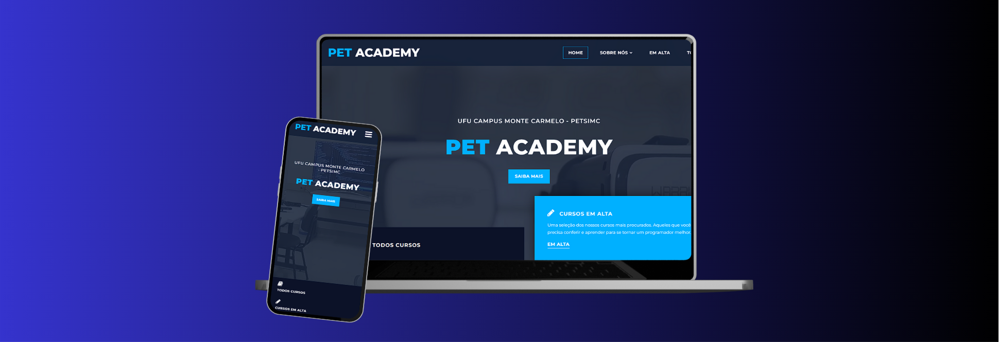

# PetAcademy - Plataforma de Educação Aberta  
  

**Acesse a plataforma**: [petacademy.vercel.app/cursos](https://petacademy.vercel.app/cursos)  

**PetAcademy** é uma plataforma de cursos desenvolvida pelo **PET-SIMC** da Universidade Federal de Uberlândia (UFU). O projeto tem como objetivo ser um meio acessível e gratuito de disseminação do conhecimento, disponível tanto para a comunidade interna da UFU quanto para o público externo.  

A plataforma oferece:  
- **Videoaulas** acessíveis para diferentes níveis de aprendizado;  
- **Exercícios práticos** para reforço dos conteúdos;  
- **Espaço para dúvidas** e interação com orientadores;  
- **Certificação** para quem conclui os cursos.  

---

## 🎯 Objetivos  

O **PetAcademy** foi criado com a missão de ajudar a reduzir as taxas de reprovação e desistência acadêmica, oferecendo um ambiente que promove o aprendizado de forma prática e eficiente.  

A proposta também busca diversificar e democratizar o ensino, tornando-o acessível para diferentes públicos, com foco inicial em **programação** e **tecnologia da informação**, mas com planos para expandir o conteúdo para outras áreas do conhecimento no futuro.  

### Metas principais:  
- **Oferecer suporte ao aprendizado** com metodologias inovadoras.  
- **Ampliar o alcance educacional** dentro e fora da UFU.  
- **Promover a interação** entre estudantes de diversas áreas.  

---

## 🛠️ Em desenvolvimento  

O projeto está em constante evolução e ainda está sendo estruturado para se tornar uma referência em educação aberta.  

**Fase atual**:  
- Desenvolvimento de conteúdos para as primeiras áreas de foco.  
- Implementação de funcionalidades para acompanhamento de progresso e emissão de certificados.  

---

## 🤝 Como participar  

Estamos abertos a sugestões, feedbacks e colaborações. Caso tenha interesse em contribuir para o **PetAcademy**, entre em contato conosco!  

📧 **E-mail**: [email-do-projeto@ufu.br](jonathan.borges@ufu.br)  
🌐 **Site oficial**: [petacademy.vercel.app](https://petacademy.vercel.app/cursos)  

--- 

> Desenvolvido com o propósito de tornar a educação acessível, gratuita e de qualidade.  
